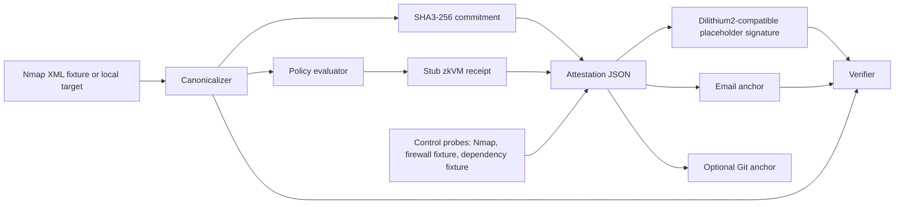

# ZKAT Architecture and Verifier Guide

## Demo architecture

## What an auditor can trust in this MVP

- The verifier recomputes the canonical SHA3-256 commitment and rejects mismatches.
- The verifier checks the attestation signature with the public key named by the attestation.
- The verifier checks chain continuity when an expected previous tip is supplied.
- The verifier checks the local stub receipt is bound to the same commitment and an allow-listed program hash.
- The verifier checks supplied email anchor payloads contain the exact attestation bytes.

## What an auditor cannot trust yet

- The zkVM receipt is a deterministic local stub, not a RISC Zero proof.
- The signature backend exposes a Dilithium2-compatible interface placeholder, not production PQC key management.
- DKIM and Git anchors are represented as locally validated artifacts; production DKIM/Git trust policy is future work.
- The fixture firewall and dependency controls are demo evidence adapters, not live enterprise integrations.

## Schema compatibility

Attestations carry `schema_version`. Verifiers accept major version `1` and may accept additive fields. Removing required fields, changing commitment semantics, or changing signature/proof verification semantics requires a new major version.
